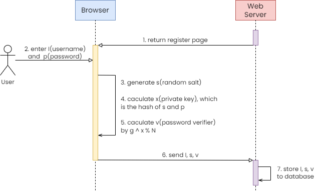

# Secure remote password protocol

The **Secure Remote Password protocol(SRP)** is a cryptographic authentication protocol designed to address the security issues associated with traditional password-based authentication mechanisms.

One of the main issues with traditional password-based authentication is the risk of password interception and replay attacks, which can result in the compromise of a user's account credentials. The SRP protocol offers a more secure approach to authentication by using a secure exchange of cryptographic secrets instead of transmitting a password in plain text.

In the SRP protocol, the client and server exchange a series of messages to establish a shared secret key without ever transmitting the password in plain text. The protocol uses a combination of symmetric and asymmetric cryptography, including a one-way hash function**, a random number generator, and modular exponentiation. By using these techniques, the SRP protocol provides a secure and efficient method for user authentication.

Overall, the SRP protocol offers a robust and secure authentication mechanism that is resistant to a wide range of attacks, including man-in-the-middle, replay, and brute-force attacks. As a result, it has become a popular choice for secure authentication in a variety of applications, including online banking, e-commerce, and other web-based services.

> All above is generated by **ChatGPT**.

## Workflow

Before starting to introduce the workflow of the protocol, we should know about several symbols defined in protocol.

| Symbol | Description |
| --- | --- |
| N | A large safe prime (N = 2q+1, where q is prime). All arithmetic is done modulo N. |
| g | A generator modulo N |
| k | Multiplier parameter (k = H(N, g) in SRP-6a, k = 3 for legacy SRP-6) |
| s | User's salt |
| I | Username |
| p | Cleartext Password |
| H() | One-way hash function |
| ^ | (Modular) Exponentiation |
| u | Random scrambling parameter |
| a,b | Secret ephemeral values |
| A,B | Public ephemeral values |
| x | Private key (derived from p and s) |
| v | Password verifier |


### Register

1. The user enters the I(username) and p(password).
2. The client generates s(random salt). Don't forget the **modulus operation**.
3. The client gets the x(private key), which is get from the hash of a(random salt) and p(password).
3. The client calculates the password verifier by the s(random salt), x(private key) and N. 
    > Here we cannot directly calculate the exponentiation because the numbers involved are huge. So we use a mathematical way [Modular exponentiation](https://en.wikipedia.org/wiki/Modular_exponentiation) instead.
4. The client sends the I(username), s(random salt) and v(password verifier) to the server.
5. The server will store these three important things to the database.



### Login

The login process is a little complicated.


Here are some safeguards need to follow:

1. The user will abort if he receives B == 0 (mod N) or u == 0.
2. The host will abort if it detects that A == 0 (mod N).
3. The user must show his proof of K first. If the server detects that the user's proof is incorrect, it must abort without showing its own proof of K.

You can see these three parts in the code, too.

> Forward from the [Stanford SRP Design](http://srp.stanford.edu/design.html).

## Example

The `server.js` acts as the server side and the `client.js` acts as the client side in the protocol. To run the example, just follow the steps below.

1. Clone the repository and enter the directory.
    ```bash
    $ git clone git@github.com:ChenYuTong10/srp.git
    $ cd srp
    ```

2. Prepare the sqlite database.
    ```bash
    $ cd database
    $ sqlite3 srp.db
    ```
    Copy the statement of the user table in `database/setup.sql` and create the table `users`. You can check the table by following command.
    ```bash
    $ .tables
    ```

3. Return to the root directory and install the dependencies.
    ```bash
    $ yarn install
    ```

4. Run the `server.js`.
    ```bash
    $ yarn start
    ```

5. Access the `http://localhost:9090/` in your browser.

**TIPS**: You can open the console when you are debugging. You can see some important symbols value in the console. Maybe it helps you when you encounter some problems.

## Reference

- [Stanford SRP Design](http://srp.stanford.edu/design.html)
- [Wikipedia Modular exponentiation](https://en.wikipedia.org/wiki/Modular_exponentiation)
- [Wikipedia Secure Remote Password protocol](https://en.wikipedia.org/wiki/Secure_Remote_Password_protocol)
